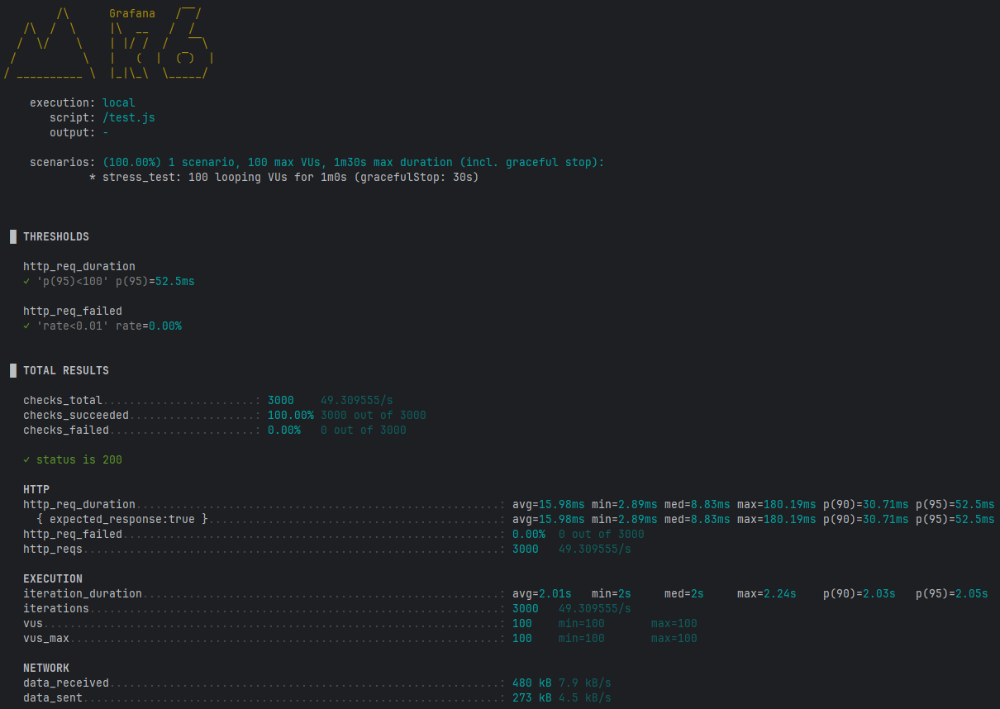

# Sistema de Gestão de Pedidos B2B
Você foi designado para desenvolver um microserviço crítico para um sistema B2B de gestão de pedidos. Este microserviço será responsável por receber, processar e gerenciar pedidos de parceiros comerciais, com potencial para milhares de requisições simultâneas.
### Prerequisitos

* Java 17
* Mavem
* PostgreSQL
* Docker
* Docker-compose

### Instalação

1. Clone o repo
```sh
git clone https://github.com/edivaldo100/SGP-B2B

cd /SGP-B2B
```
2. Start com docker-compose
```sh
	docker-compose up
```
ou
Start com docker-compose com 2 replicas

remove:
```sh
	docker-compose down --volumes --remove-orphans
```
reinicia novamente:
```sh
	docker-compose up -d --build --force-recreate --scale restapi=2
```

### Detalhes

Eurika-server http://localhost:8761/

swagger : http://localhost/swagger-ui/index.html#/

isAlive : http://localhost/restapi/isAlive
```sh
curl -X 'GET' \
  'http://localhost:8080/restapi/isAlive' \
  -H 'accept: */*'
```
Criar Parceiro:
```sh 
curl -X 'POST' \
  'http://localhost/restapi/api/partners' \
  -H 'accept: */*' \
  -H 'Content-Type: application/json' \
  -d '{
  "id": 1,
  "name": "string1",
  "creditLimit": 1000000,
  "currentCredit": 100000
}'
```
Consulta Parceiro
```sh
curl -X 'GET' \
  'http://localhost/restapi/api/orders' \
  -H 'accept: */*'
   ```
   
Criar um pedido
```sh
    curl -X 'POST' \
  'http://localhost/restapi/api/orders' \
  -H 'accept: */*' \
  -H 'Content-Type: application/json' \
  -d '{
  "partnerId": 1,
  "items": [
    {
      "product": "banana",
      "quantity": 10,
      "unitPrice": 10
    }
  ]
}'
   ```

Consulta pedidos
```sh
curl -X 'GET' \
  'http://localhost/restapi/api/orders' \
  -H 'accept: */*'
   ```
### Arquitetura proposta   


### Teste de carga K6 Grafana

windows
```sh
$env:K6_SCRIPT_FILE='test.js'; docker-compose run --rm k6_tester
   ```
linux
```sh
K6_SCRIPT_FILE=test.js docker-compose run --rm k6_tester
   ```

usando apenas 2 instancias 
